# Schéma d'architecture cible — Cabinet Maître Devalle

> Mini-cours `05`. Solution sobre, souveraine et sécurisée pour l'aide à la décision et la pré-rédaction.  
> Respect strict des exigences déontologiques du Barreau (secret professionnel) et budget maîtrisé.

## 1. Schéma d'architecture (Mermaid)

```mermaid
%%{init: {'theme': 'base', 'themeVariables': { 'primaryTextColor': '#000000', 'textColor': '#000000', 'clusterBkg': '#fafafa', 'clusterBorder': '#78909c' }}}%%
flowchart LR
    subgraph SOUR["1. Sources documentaires du Cabinet"]
        direction TB
        REG["Registre des Décisions<br/>(CSV / métadonnées: matière, date, issue)"]
        DOCS["Fonds de 2 000 Décisions<br/>(PDF natifs, scans, Word)"]
        MODELS["Modèles & Historique Courriers<br/>(Recouvrement, Baux commerciaux)"]
    end

    subgraph INGEST["2. Ingestion & Nettoyage (Batch/Sécurisé)"]
        direction TB
        OCR["Module OCR & Extraction Texte<br/>(Tesseract / PyMuPDF)"]
        ANON["Module de Pseudonymisation<br/>(Détection PII - Risque 🔴)"]
        CHUNKER["Découpage & Indexation hybride<br/>(Texte + Métadonnées)"]
        OCR --> ANON --> CHUNKER
    end

    subgraph STOCK["3. Stockage Sécurisé Souverain Managé (SecNumCloud)"]
        direction TB
        VDB[("Base Vectorielle gérée<br/>(Embeddings souverains - ChromaDB/Qdrant)")]
        SQLDB[("Base Métadonnées & Références<br/>(PostgreSQL managé / Sauvegarde auto)")]
    end

    subgraph MOTOR["4. Moteur RAG & LLM Compact Managé (PaaS Souverain FR)"]
        direction TB
        RETRIEVER["Moteur de Recherche & Filtrage<br/>(Filtre matière/date + similarité)"]
        LLM["LLM Frugal Managé Souverain<br/>(Mistral-7B / Llama-8B infogéré - DPA strict)"]
        GROUNDING["Contrôle d'ancrage strict<br/>(Traçabilité sources 100% - Risque 🔴)"]
        RETRIEVER --> LLM --> GROUNDING
    end

    subgraph USER["5. Interface Métier & Contrôle Humain Obligatoire"]
        direction TB
        UI["Interface interne Web / Plugin Word<br/>(Avocats & Assistantes)"]
        REVUE["Validation Humaine & Signature<br/>(Avocat responsable légal - Risque 🔴)"]
        LOGS["Journalisation & Audit interne<br/>(Logs d'accès déontologiques)"]
        UI --> REVUE
        UI -.-> LOGS
    end

    %% Flux de données
    DOCS --> OCR
    REG --> CHUNKER
    MODELS --> ANON
    CHUNKER --> VDB
    CHUNKER --> SQLDB
    SQLDB <--> RETRIEVER
    VDB <--> RETRIEVER
    UI <--> RETRIEVER
    GROUNDING --> UI

    classDef sourceStyle fill:#e1f5fe,stroke:#0288d1,stroke-width:2px,color:#000000;
    classDef processStyle fill:#fff3e0,stroke:#f57c00,stroke-width:2px,color:#000000;
    classDef storageStyle fill:#e8f5e9,stroke:#388e3c,stroke-width:2px,color:#000000;
    classDef aiStyle fill:#ede7f6,stroke:#512da8,stroke-width:2px,color:#000000;
    classDef userStyle fill:#fce4ec,stroke:#c2185b,stroke-width:2px,color:#000000;

    class REG,DOCS,MODELS sourceStyle;
    class OCR,ANON,CHUNKER processStyle;
    class VDB,SQLDB storageStyle;
    class RETRIEVER,LLM,GROUNDING aiStyle;
    class UI,REVUE,LOGS userStyle;
```

---

## 2. Description des composants

1. **Sources documentaires internes** :
   - Le registre des décisions (`data/cas_A_registre_decisions_sample.csv`) avec ses métadonnées structurées (`matiere`, `date`, `issue`, `juridiction`).
   - Le corpus de ~2 000 décisions du cabinet (Bordeaux).
   - Les gabarits de courriers types et historiques de courriers (périmètre initial : recouvrement de créances et baux commerciaux).
2. **Ingestion & Nettoyage sécurisé** :
   - **OCR / Extraction de texte** : convertit les scans papier anciens et documents Word en texte brut exploitable.
   - **Module de pseudonymisation (Traitement Risque 🔴)** : masque systématiquement les noms de personnes physiques, coordonnées et données bancaires avant indexation ou transmission au modèle.
   - **Indexation hybride** : associe le texte vectorisé aux métadonnées pour permettre des recherches croisées (ex. *« bail commercial + issue favorable + clause résolutoire »*).
3. **Stockage sécurisé souverain managé (SecNumCloud)** :
   - Base vectorielle (ChromaDB / Qdrant) et base relationnelle de métadonnées, infogérées sur une infrastructure cloud française qualifiée SecNumCloud (ex. OVHcloud / Scaleway).
   - **Réponse à l'imprévu informatique du 31/12** : évite tout maintien de serveur physique au cabinet en l'absence de prestataire IT, avec sauvegardes automatiques quotidiennes et clause contractuelle de réversibilité.
4. **Moteur RAG & LLM Compact Managé Souverain** :
   - **Moteur de recherche sémantique** : retrouve les extraits pertinents en moins d'une minute via filtrage par facettes et similarité sémantique.
   - **LLM compact (7B à 8B paramètres)** : service d'inférence infogéré souverain avec contrat DPA strict (aucune conservation ni réutilisation des requêtes pour l'entraînement).
   - **Contrôle d'ancrage strict (Grounding - Traitement Risque 🔴)** : garantit que chaque citation provient d'un document réel et génère un lien vérifiable vers la décision d'origine (tolérance zéro hallucination).
5. **Interface métier & Contrôle humain obligatoire** :
   - Interface interne réservée aux assistantes et aux 12 avocats (pas d'ouverture web externe).
   - **Validation humaine systématique (Traitement Risque 🔴)** : l'avocat relit impérativement le projet, l'ajuste et appose sa signature. L'outil n'émet aucun acte juridique de manière autonome.
   - **Journalisation & audit** : traçabilité des consultations et des générations pour la conformité et la déontologie.

---

## 3. Ce qu'on n'a PAS mis (et pourquoi)

- **Pas d'API de LLM propriétaire grand public (ex. OpenAI / ChatGPT)** :
  - *Raison :* Incompatible avec l'article 66-5 du secret professionnel de l'avocat et risque de sanctions ordinales du Barreau. Coût récurrent imprévisible au token et dépendance hors-UE.
- **Pas de Chatbot conversationnel externe pour le site web** :
  - *Raison :* Exclu formellement du périmètre par Maître Devalle en entretien. Aurait fait basculer le projet sous les obligations de transparence de l'article 50 de l'AI Act et aurait créé un risque d'engagement de responsabilité sans contrôle d'avocat.
- **Pas de fine-tuning (réentraînement) lourd de modèle** :
  - *Raison :* Coût excessif non finançable avec l'enveloppe de 15 000 €, absence de dataset labellisé, risque d'oubli catastrophique et de rigidité lors des mises à jour du droit. L'approche RAG (Retrieval-Augmented Generation) est infiniment plus sobre, actualisable et traçable.
- **Pas d'agent autonome avec droits d'envoi ou d'exécution d'actes** :
  - *Raison :* La responsabilité juridique et déontologique repose exclusivement sur l'avocat. L'assistant n'a aucun droit d'écriture ou d'envoi automatique.
